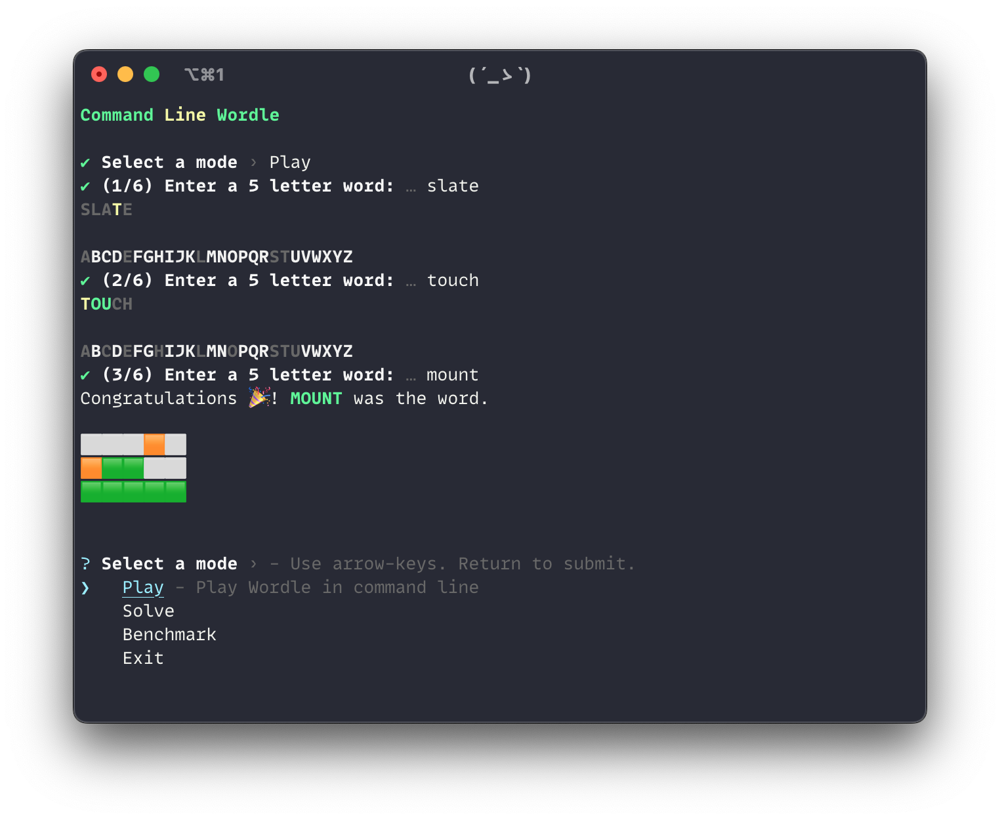

# wordle-cli

Play (or solve) a game of Wordle in your terminal.



## Installation

Clone the repository. Once in the directory, run:

```bash
npm install
```

## Usage

To start `wordle-cli`, run:

```bash
node index.js
```

Use arrow keys to navigate the menu. Press Enter to select an option.

There are three modes: Play, Solve, and Benchmark.

### Play

Play a classic game of Wordle. Guess the five-letter word in six tries or less. Press Enter to submit a guess.

### Solve

Solves a game of Wordle. Enter the result of a guess, and wordle-cli will tell you the next best guess to make. Input the guess results using the following format:

- Use `?` after a letter to indicate a yellow letter (e.g. `F?`)
- Use `!` after a letter to indicate a gray letter (e.g. `V!`)
- Any other character will be considered a green letter.

Examples of valid inputs: `SL!A?T!E?` or `C!RON!Y!`.


> **Note** Each instance of the solver has its own internal state of letters that have been guessed in the current game. You need to start a fresh instance of the solver for each game you want to solve.

### Benchmark

Benchmarks the solver algorithm against all 2315 possible words. Currently, the solver algorithm solves a game in approximately 3.59 guesses on average, using SALET as the first guess.